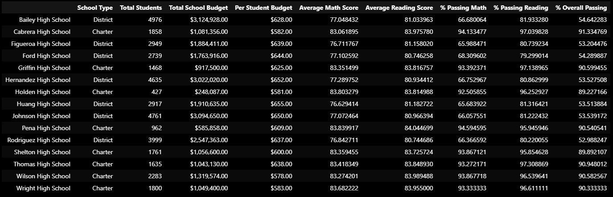
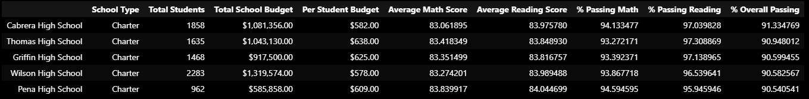
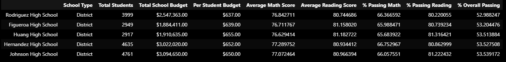
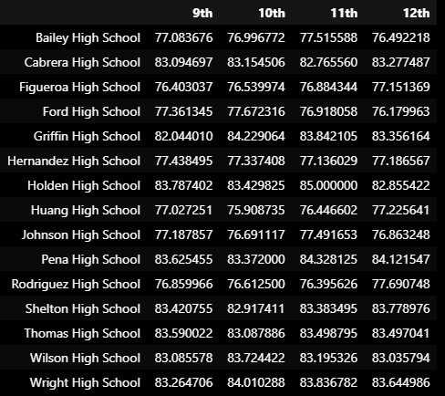
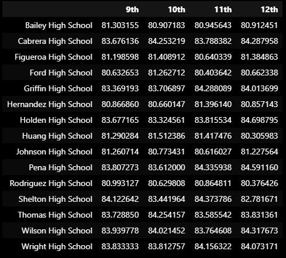
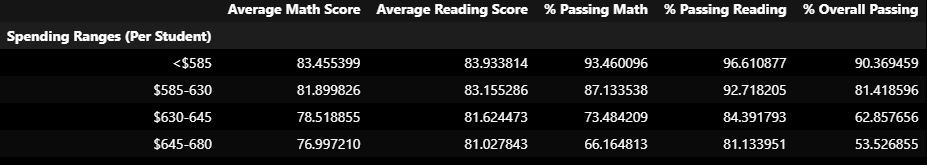
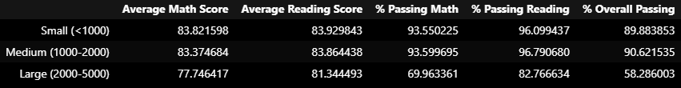
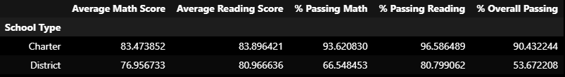

# Analyzing School District Data using Pandas

## Introduction
This project aims to analyze standardized test results from a school district using Python's Pandas library. Acting as the new Chief Data Scientist for the city's school district, the task is to provide insights to the school board and mayor for informed decision-making regarding future school budgets and priorities.

## Summary and Analysis 
Among the 15 schools in the district, the budget of over $24 million is divided among almost 40,000 students, but it is not divided equally between the schools. Shown in Figure 1, the average reading scores and percentage passing reading are within the B range. However, the analysis shows that the average math score, percentage passing math, and percentage overall passing is below the range in which most school officials would like to see. The average math scores and percentage passing math is in the C range. And the most severe outcome is the percentage overall passing is in the D range. 

The analysis shows the trends in the different schools have different outcomes that vary tremendously. There are two types of schools, Charter and District. In Figure 2, the scores for percentage overall pass rate ranges from A to F letter grades. The school summary gives better insight into which schools are thriving in excellence. Among those notable schools that have achieved this is Cabrara High School and Thomas High School. However, some schools are failing their students, of the lowest scores is Rodriguez High School, with a percentage overall passing in the F range.

 
**Figure 1. District Summary.**

 
**Figure 2. School Summary.**

 

A more in-depth analysis into the percentage overall passing is shown in Figures 3 and 4, shown below. All the top schools having percentage overall passing rates are Charter schools. The total number of students in these schools is within the range of 900 to 2300. The data shows that they consistently have scores of B grade for both average math and reading scores and perform in the A range in percentage passing math and reading. In Figure 4, the lowest performing schools are highlighted. All these schools are District schools. The total number of students in these schools is much higher than the highest-performing Charter schools, ranging from 2900 to 4800. It also shows that the budget per student is consistently higher dollar amount than the highest performing schools. The percentage overall passing rate for these schools falls into the F range, failing about 50% of students.
 
**Figure 3. Highest-Performing Schools by Percentage of Overall Passing.**

 
 
**Figure 4. Lowest-Performing Schools by Percentage of Overall Passing.**

 

The math and reading scores by grade are seen in Figures 5 and 6 The proficiency for each grade is consistent from freshman to senior year. The instruction from teachers should be relatively the same throughout each school. In math, schools perform within the B and C range. In reading, the schools perform better, within the B range. These figures give greater insight on the weaknesses that some schools struggle in math more than in the topic of reading.

        
**Figure 5. Math Scores by Grade.** 

                 

**Figure 6. Reading Scores by Grade.**

 

Schools are broken down into three figures, highlighting scores per student spending, scores per school size, and scores by school type, as can be seen below. In Figure 7, it shows that the more is spent on each student, the lower the grades are. This can be misleading and must be correlated with other contributing factors, such as classroom size, which is not provided in this dataset. Furthermore, in Figure 8, the smaller the school size, the higher the success rate is for the student to have higher scores in both math and reading. The largest school size performance was a failing situation for some students. Finally, in Figure 9, the Charter schools do an outstanding job in providing an education that sets students up for successful outcomes. However, District school’s performance is not helping students succeed.

 
**Figure 7. Scores by School Spending.**

   
 
**Figure 8. Scores by School Size.**

   
 
**Figure 9. Scores by School Type.**

   

## In conclusion
The analysis of the entire district shows the average reading scores and percentage passing reading is in the letter grade B, math scores and percentage passing math are in the C range, and the percentage overall passing is D.  However, some schools have been shown to be outstanding, including Cabrara High School and Thomas High School. But some schools are performing the worst, such as Rodriguez High School. The students per school vary from ~900 to ~4800, with Charter schools having fewer students than the District schools. The most troubling finding is the schools attaining the highest budget per student perform the lowest in scores. With this said, two overall conclusions can be made with this dataset: Charter schools perform better than District schools overall, and the larger the school size, the more likely the students will perform worse in both math and reading. An explanation for this could be because the Charter schools are consistently smaller in size, and this means the students may have smaller classroom sizes – leading to more one-on-one time with the teacher. However, more data should be gathered about the size of classrooms to help draw a conclusion if the classroom size may be a significant contribution to the likelihood of success for each student.

